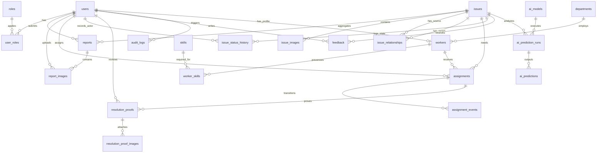

# CivicFix Database & AI Data Layer Architecture Specification

This document provides the complete, production-ready specification for the **CivicFix** database and AI data layer.

---

## 1. Critical Analysis of the Original Rough ER Model

Critique of the initial rough ER diagram:
1.  **Multivalued Skills Column**: `workers.skills` was proposed as a comma-separated string or simple array. This violates **First Normal Form (1NF)**. It prevents joining on skills, indexing them efficiently, or ensuring skill validation.
2.  **Single Image Limitation**: `issues.image_url` and `reports.image_url` limit citizens and workers to uploading exactly one image. A proper audit and resolution flow requires multiple photos (e.g., wide shot, close-up, and before/after verification).
3.  **Ambiguous Report vs. Issue Ownership**: The rough design did not clearly separate a citizen's subjective report from the city's canonical operational issue. Keeping them on a single tier causes duplicate reports to overwrite canonical status data or bloat the issues backlog with duplicate workflows.
4.  **No AI Prediction Auditing**: The rough design lacks tracking for model versions, prediction runs, and confidence scores. Overwriting fields directly with AI predictions destroys the audit trail of model performance and human overrides.
5.  **No Assignment Event Trail**: `assignments` only tracked the current status and timestamps. There was no historical trail of *why* assignments were rejected or cancelled, which is critical for worker performance analysis.

---

## 2. Report-versus-Issue Core Business Rule

*   **Rule**: A **REPORT** is an individual citizen submission (`reports.issue_id` is nullable during intake). An **ISSUE** is a canonical physical civic problem (`issues` table).
*   **Workflow**:
    1.  Citizen A submits Report 1 ("Large pothole near College Gate"). `reports.issue_id` is NULL initially.
    2.  Canonical Issue 1 is created. `Report 1.issue_id` is linked to Issue 1.
    3.  Citizen B submits Report 2 ("Deep pothole outside same College Gate").
    4.  AI duplicate detection runs and suggests Issue 1 as a candidate match.
    5.  Authority confirms the match and links `Report 2.issue_id` to Issue 1.
    6.  **Result**: Two report records, one canonical issue record. All original descriptions, coordinates, timestamps, and uploaded images of Citizen A and B are preserved independently.

---

## 3. Final Table List (24 Core Tables)

| # | Table Name | Purpose | MVP / Future |
|---|---|---|---|
| 1 | `roles` | System user access roles (CITIZEN, AUTHORITY, WORKER, ADMIN) | MVP |
| 2 | `users` | Credentials, user identity, contact details | MVP |
| 3 | `user_roles` | Many-to-many junction for user role assignments | MVP |
| 4 | `departments` | Municipal operational departments | MVP |
| 5 | `workers` | Field worker profile separate from core identity | MVP |
| 6 | `skills` | Reference list of worker skills | MVP |
| 7 | `worker_skills` | Junction table for worker skill assignments | MVP |
| 8 | `issue_categories` | Reference list of issue categories | MVP |
| 9 | `issues` | Canonical operational civic problem entity | MVP |
| 10 | `reports` | Individual citizen report submissions | MVP |
| 11 | `report_images` | Citizen uploaded image metadata | MVP |
| 12 | `issue_images` | Canonical issue image metadata | MVP |
| 13 | `assignments` | Task allocations to field workers | MVP |
| 14 | `assignment_events` | Historic event trail for assignments | MVP |
| 15 | `issue_status_history` | Automated status transition history | MVP |
| 16 | `ai_models` | AI model checkpoints and framework registry | Future / AI |
| 17 | `ai_prediction_runs` | Executed AI inference runs | Future / AI |
| 18 | `ai_predictions` | Predicted classification, priority, and confidence metrics | Future / AI |
| 19 | `issue_relationships` | Duplicate, merge, and split audit records | MVP |
| 20 | `resolution_proofs` | Worker completion submissions | MVP |
| 21 | `resolution_proof_images` | Worker before/after completion photo metadata | MVP |
| 22 | `notifications` | Persistent user in-app notifications | MVP |
| 23 | `feedback` | Citizen reviews and ratings for resolved issues | MVP |
| 24 | `audit_logs` | Append-only database mutation audit trail | MVP |

---

## 4. Complete Table Specifications

### 1. `roles`
Purpose: Roles mapping (CITIZEN, AUTHORITY, WORKER, ADMIN).
Columns:
| Column | Type | PK/FK | Nullable | Default | Description |
|---|---|---|---|---|---|
| id | UUID | PK | NO | gen_random_uuid() | Primary Key |
| name | VARCHAR(50) | - | NO | - | Role code name |
| description | TEXT | - | YES | - | Role description |
| created_at | TIMESTAMPTZ | - | NO | CURRENT_TIMESTAMP | Created time |

### 2. `users`
Purpose: User identity, authentication, credentials, and state.
Columns:
| Column | Type | PK/FK | Nullable | Default | Description |
|---|---|---|---|---|---|
| id | UUID | PK | NO | gen_random_uuid() | Primary Key |
| full_name | VARCHAR(150) | - | NO | - | Full display name |
| email | VARCHAR(255) | - | NO | - | Case-insensitive unique email |
| phone | VARCHAR(30) | - | YES | - | Contact phone |
| password_hash | VARCHAR(255) | - | NO | - | Bcrypt hashed password |
| is_active | BOOLEAN | - | NO | TRUE | Active status |
| created_at | TIMESTAMPTZ | - | NO | CURRENT_TIMESTAMP | Created time |
| updated_at | TIMESTAMPTZ | - | NO | CURRENT_TIMESTAMP | Updated time |
| deleted_at | TIMESTAMPTZ | - | YES | - | Soft-delete timestamp |

### 3. `user_roles`
Purpose: Junction mapping users to roles.
Columns:
| Column | Type | PK/FK | Nullable | Default | Description |
|---|---|---|---|---|---|
| user_id | UUID | PK, FK | NO | - | Foreign Key to users |
| role_id | UUID | PK, FK | NO | - | Foreign Key to roles |
| created_at | TIMESTAMPTZ | - | NO | CURRENT_TIMESTAMP | Created time |

### 4. `departments`
Purpose: Reference list of municipal departments.
Columns:
| Column | Type | PK/FK | Nullable | Default | Description |
|---|---|---|---|---|---|
| id | UUID | PK | NO | gen_random_uuid() | Primary Key |
| code | VARCHAR(50) | - | NO | - | Department unique code |
| name | VARCHAR(100) | - | NO | - | Department name |
| description | TEXT | - | YES | - | Department details |
| is_active | BOOLEAN | - | NO | TRUE | Active status |
| created_at | TIMESTAMPTZ | - | NO | CURRENT_TIMESTAMP | Created time |
| updated_at | TIMESTAMPTZ | - | NO | CURRENT_TIMESTAMP | Updated time |

### 5. `workers`
Purpose: Profile for field workers separate from users identity.
Columns:
| Column | Type | PK/FK | Nullable | Default | Description |
|---|---|---|---|---|---|
| id | UUID | PK | NO | gen_random_uuid() | Primary Key |
| user_id | UUID | FK | NO | - | Foreign Key to users (UNIQUE) |
| department_id | UUID | FK | NO | - | Foreign Key to departments |
| worker_status | VARCHAR(50) | - | NO | 'ACTIVE' | Worker employment status |
| availability_status | VARCHAR(50) | - | NO | 'AVAILABLE' | Work availability state |
| years_experience | INTEGER | - | YES | 0 | Experience years |
| current_location | GEOGRAPHY | - | YES | - | Spatial coordinates (Point, 4326) |
| joined_at | TIMESTAMPTZ | - | NO | CURRENT_TIMESTAMP | Joining date |
| created_at | TIMESTAMPTZ | - | NO | CURRENT_TIMESTAMP | Created time |
| updated_at | TIMESTAMPTZ | - | NO | CURRENT_TIMESTAMP | Updated time |

### 6. `skills`
Purpose: Reference list of worker skills.
Columns:
| Column | Type | PK/FK | Nullable | Default | Description |
|---|---|---|---|---|---|
| id | UUID | PK | NO | gen_random_uuid() | Primary Key |
| name | VARCHAR(100) | - | NO | - | Skill name |
| description | TEXT | - | YES | - | Skill details |
| created_at | TIMESTAMPTZ | - | NO | CURRENT_TIMESTAMP | Created time |

### 7. `worker_skills`
Purpose: Many-to-many junction for worker skills.
Columns:
| Column | Type | PK/FK | Nullable | Default | Description |
|---|---|---|---|---|---|
| worker_id | UUID | PK, FK | NO | - | Foreign Key to workers |
| skill_id | UUID | PK, FK | NO | - | Foreign Key to skills |
| created_at | TIMESTAMPTZ | - | NO | CURRENT_TIMESTAMP | Created time |

### 8. `issue_categories`
Purpose: Reference table for issue categories.
Columns:
| Column | Type | PK/FK | Nullable | Default | Description |
|---|---|---|---|---|---|
| id | UUID | PK | NO | gen_random_uuid() | Primary Key |
| code | VARCHAR(50) | - | NO | - | Unique category code |
| name | VARCHAR(100) | - | NO | - | Category display name |
| description | TEXT | - | YES | - | Category description |
| is_active | BOOLEAN | - | NO | TRUE | Active status |
| created_at | TIMESTAMPTZ | - | NO | CURRENT_TIMESTAMP | Created time |
| updated_at | TIMESTAMPTZ | - | NO | CURRENT_TIMESTAMP | Updated time |

### 9. `issues`
Purpose: Canonical operational civic problem entity.
Columns:
| Column | Type | PK/FK | Nullable | Default | Description |
|---|---|---|---|---|---|
| id | UUID | PK | NO | gen_random_uuid() | Primary Key |
| title | VARCHAR(150) | - | NO | - | Canonical issue title |
| canonical_description | TEXT | - | YES | - | Canonical issue summary |
| category_id | UUID | FK | YES | - | Foreign Key to issue_categories |
| severity | VARCHAR(50) | FK | YES | - | Foreign Key to severity_levels |
| priority | VARCHAR(50) | FK | YES | - | Foreign Key to priority_levels |
| current_status | VARCHAR(50) | FK | NO | 'REPORTED' | Foreign Key to issue_statuses |
| department_id | UUID | FK | YES | - | Foreign Key to departments |
| location | GEOGRAPHY | - | NO | - | Spatial point geography(Point, 4326) |
| address_line | VARCHAR(255) | - | YES | - | Address line |
| area | VARCHAR(100) | - | YES | - | Neighborhood / Area |
| city | VARCHAR(100) | - | YES | - | City name |
| postal_code | VARCHAR(20) | - | YES | - | Postal code |
| verified_by | UUID | FK | YES | - | Authority user ID who verified |
| verified_at | TIMESTAMPTZ | - | YES | - | Verification timestamp |
| resolved_at | TIMESTAMPTZ | - | YES | - | Resolution timestamp |
| closed_at | TIMESTAMPTZ | - | YES | - | Closing timestamp |
| created_at | TIMESTAMPTZ | - | NO | CURRENT_TIMESTAMP | Created time |
| updated_at | TIMESTAMPTZ | - | NO | CURRENT_TIMESTAMP | Updated time |

### 10. `reports`
Purpose: Individual citizen submissions.
Columns:
| Column | Type | PK/FK | Nullable | Default | Description |
|---|---|---|---|---|---|
| id | UUID | PK | NO | gen_random_uuid() | Primary Key |
| reporter_id | UUID | FK | NO | - | Foreign Key to users |
| issue_id | UUID | FK | YES | - | Foreign Key to issues (null at intake) |
| title | VARCHAR(150) | - | YES | - | Citizen report title |
| description | TEXT | - | NO | - | Citizen raw report text |
| location | GEOGRAPHY | - | NO | - | Spatial location geography(Point, 4326) |
| created_at | TIMESTAMPTZ | - | NO | CURRENT_TIMESTAMP | Created time |
| updated_at | TIMESTAMPTZ | - | NO | CURRENT_TIMESTAMP | Updated time |

### 11. `report_images`
Purpose: Image metadata uploaded by citizens.
Columns:
| Column | Type | PK/FK | Nullable | Default | Description |
|---|---|---|---|---|---|
| id | UUID | PK | NO | gen_random_uuid() | Primary Key |
| report_id | UUID | FK | NO | - | Foreign Key to reports |
| storage_provider | VARCHAR(50) | - | NO | - | Storage service (e.g. S3) |
| object_key | VARCHAR(512) | - | NO | - | Storage key / URL reference |
| original_filename | VARCHAR(255) | - | NO | - | File original name |
| mime_type | VARCHAR(100) | - | NO | - | Image mime type |
| file_size_bytes | BIGINT | - | NO | - | File size in bytes |
| checksum | VARCHAR(64) | - | NO | - | SHA256 file checksum |
| width | INTEGER | - | YES | - | Image pixel width |
| height | INTEGER | - | YES | - | Image pixel height |
| uploaded_by_user_id | UUID | FK | NO | - | Foreign Key to users |
| created_at | TIMESTAMPTZ | - | NO | CURRENT_TIMESTAMP | Created time |

### 12. `issue_images`
Purpose: Canonical images attached to issues.
Columns:
| Column | Type | PK/FK | Nullable | Default | Description |
|---|---|---|---|---|---|
| id | UUID | PK | NO | gen_random_uuid() | Primary Key |
| issue_id | UUID | FK | NO | - | Foreign Key to issues |
| storage_provider | VARCHAR(50) | - | NO | - | Storage service |
| object_key | VARCHAR(512) | - | NO | - | Storage key |
| original_filename | VARCHAR(255) | - | NO | - | Original filename |
| mime_type | VARCHAR(100) | - | NO | - | Mime type |
| file_size_bytes | BIGINT | - | NO | - | Size in bytes |
| checksum | VARCHAR(64) | - | NO | - | SHA256 checksum |
| created_at | TIMESTAMPTZ | - | NO | CURRENT_TIMESTAMP | Created time |

### 13. `assignments`
Purpose: Work allocations to field workers.
Columns:
| Column | Type | PK/FK | Nullable | Default | Description |
|---|---|---|---|---|---|
| id | UUID | PK | NO | gen_random_uuid() | Primary Key |
| issue_id | UUID | FK | NO | - | Foreign Key to issues |
| worker_id | UUID | FK | NO | - | Foreign Key to workers |
| department_id | UUID | FK | YES | - | Foreign Key to departments |
| assigned_by | UUID | FK | NO | - | Foreign Key to users (Authority) |
| assignment_status | VARCHAR(50) | FK | NO | 'ASSIGNED' | Foreign Key to assignment_statuses |
| assigned_at | TIMESTAMPTZ | - | NO | CURRENT_TIMESTAMP | Assignment timestamp |
| accepted_at | TIMESTAMPTZ | - | YES | - | Accepted timestamp |
| rejected_at | TIMESTAMPTZ | - | YES | - | Rejected timestamp |
| started_at | TIMESTAMPTZ | - | YES | - | Work started timestamp |
| completed_at | TIMESTAMPTZ | - | YES | - | Work completed timestamp |
| rejection_reason | TEXT | - | YES | - | Rejection notes |
| reassignment_reason | TEXT | - | YES | - | Reassignment notes |
| notes | TEXT | - | YES | - | Special worker notes |
| created_at | TIMESTAMPTZ | - | NO | CURRENT_TIMESTAMP | Created time |
| updated_at | TIMESTAMPTZ | - | NO | CURRENT_TIMESTAMP | Updated time |

### 14. `assignment_events`
Purpose: Detailed action history log for worker assignments.
Columns:
| Column | Type | PK/FK | Nullable | Default | Description |
|---|---|---|---|---|---|
| id | UUID | PK | NO | gen_random_uuid() | Primary Key |
| assignment_id | UUID | FK | NO | - | Foreign Key to assignments |
| event_type | VARCHAR(50) | - | NO | - | Action type |
| actor_user_id | UUID | FK | NO | - | Foreign Key to users |
| notes | TEXT | - | YES | - | Event notes |
| created_at | TIMESTAMPTZ | - | NO | CURRENT_TIMESTAMP | Created time |

### 15. `issue_status_history`
Purpose: Complete status transition audit record.
Columns:
| Column | Type | PK/FK | Nullable | Default | Description |
|---|---|---|---|---|---|
| id | UUID | PK | NO | gen_random_uuid() | Primary Key |
| issue_id | UUID | FK | NO | - | Foreign Key to issues |
| previous_status | VARCHAR(50) | FK | YES | - | Previous status code |
| new_status | VARCHAR(50) | FK | NO | - | New status code |
| changed_by_user_id | UUID | FK | YES | - | Foreign Key to users |
| remarks | TEXT | - | YES | - | Transition remarks |
| created_at | TIMESTAMPTZ | - | NO | CURRENT_TIMESTAMP | Created time |

### 16. `ai_models`
Purpose: Model registry storing framework and checkpoint metadata.
Columns:
| Column | Type | PK/FK | Nullable | Default | Description |
|---|---|---|---|---|---|
| id | UUID | PK | NO | gen_random_uuid() | Primary Key |
| model_name | VARCHAR(100) | - | NO | - | Model algorithm name |
| model_version | VARCHAR(50) | - | NO | - | Model checkpoint version |
| model_type | VARCHAR(50) | - | NO | - | Model prediction type |
| framework | VARCHAR(50) | - | NO | - | PyTorch / YOLOv8 / TF |
| class_mapping | JSONB | - | YES | - | Label mapping JSON |
| model_artifact_location | TEXT | - | YES | - | Model file path/key |
| metrics | JSONB | - | YES | - | Model accuracy metrics JSON |
| is_active | BOOLEAN | - | NO | TRUE | Active status |
| created_at | TIMESTAMPTZ | - | NO | CURRENT_TIMESTAMP | Created time |

### 17. `ai_prediction_runs`
Purpose: Track executed inference runs on issues/reports.
Columns:
| Column | Type | PK/FK | Nullable | Default | Description |
|---|---|---|---|---|---|
| id | UUID | PK | NO | gen_random_uuid() | Primary Key |
| issue_id | UUID | FK | YES | - | Foreign Key to issues |
| report_id | UUID | FK | YES | - | Foreign Key to reports |
| model_id | UUID | FK | NO | - | Foreign Key to ai_models |
| run_status | VARCHAR(50) | - | NO | 'PENDING' | Execution state |
| started_at | TIMESTAMPTZ | - | NO | CURRENT_TIMESTAMP | Start time |
| completed_at | TIMESTAMPTZ | - | YES | - | Completion time |
| error_message | TEXT | - | YES | - | Error stack trace |
| input_hash | VARCHAR(64) | - | YES | - | SHA256 input data hash |
| created_at | TIMESTAMPTZ | - | NO | CURRENT_TIMESTAMP | Created time |

### 18. `ai_predictions`
Purpose: Inference outputs stored as recommendations.
Columns:
| Column | Type | PK/FK | Nullable | Default | Description |
|---|---|---|---|---|---|
| id | UUID | PK | NO | gen_random_uuid() | Primary Key |
| prediction_run_id | UUID | FK | NO | - | Foreign Key to ai_prediction_runs |
| prediction_type | VARCHAR(50) | - | NO | - | Prediction type code |
| predicted_category_id | UUID | FK | YES | - | Predicted category reference |
| predicted_severity | VARCHAR(50) | FK | YES | - | Predicted severity reference |
| predicted_priority | VARCHAR(50) | FK | YES | - | Predicted priority reference |
| confidence_score | NUMERIC(4,3) | - | YES | - | Confidence metric [0, 1] |
| duplicate_score | NUMERIC(4,3) | - | YES | - | Duplicate score [0, 1] |
| raw_output | JSONB | - | YES | - | Full raw model logits JSON |
| created_at | TIMESTAMPTZ | - | NO | CURRENT_TIMESTAMP | Created time |

### 19. `issue_relationships`
Purpose: Track duplicate candidates, merges, splits, and relations.
Columns:
| Column | Type | PK/FK | Nullable | Default | Description |
|---|---|---|---|---|---|
| id | UUID | PK | NO | gen_random_uuid() | Primary Key |
| source_issue_id | UUID | FK | NO | - | Foreign Key to issues (source) |
| target_issue_id | UUID | FK | NO | - | Foreign Key to issues (target) |
| relationship_type | VARCHAR(50) | FK | NO | - | Foreign Key to relationship_types |
| review_status | VARCHAR(50) | - | NO | 'PENDING' | PENDING / CONFIRMED / REJECTED |
| confidence_score | NUMERIC(4,3) | - | YES | - | Detection confidence [0, 1] |
| detection_source | VARCHAR(50) | - | NO | 'AI' | Source (AI / HUMAN) |
| model_prediction_run_id | UUID | FK | YES | - | Foreign Key to ai_prediction_runs |
| reviewed_by_user_id | UUID | FK | YES | - | Foreign Key to users |
| reviewed_at | TIMESTAMPTZ | - | YES | - | Review timestamp |
| notes | TEXT | - | YES | - | Review notes |
| created_at | TIMESTAMPTZ | - | NO | CURRENT_TIMESTAMP | Created time |

### 20. `resolution_proofs`
Purpose: Worker completion evidence submissions.
Columns:
| Column | Type | PK/FK | Nullable | Default | Description |
|---|---|---|---|---|---|
| id | UUID | PK | NO | gen_random_uuid() | Primary Key |
| issue_id | UUID | FK | NO | - | Foreign Key to issues |
| assignment_id | UUID | FK | NO | - | Foreign Key to assignments |
| submitted_by_worker_id | UUID | FK | NO | - | Foreign Key to workers |
| status | VARCHAR(50) | FK | NO | 'SUBMITTED' | Foreign Key to resolution_proof_statuses |
| description | TEXT | - | YES | - | Worker completion description |
| submitted_at | TIMESTAMPTZ | - | NO | CURRENT_TIMESTAMP | Submission timestamp |
| reviewed_by_user_id | UUID | FK | YES | - | Foreign Key to users |
| reviewed_at | TIMESTAMPTZ | - | YES | - | Review timestamp |
| rejection_reason | TEXT | - | YES | - | Rejection notes |
| created_at | TIMESTAMPTZ | - | NO | CURRENT_TIMESTAMP | Created time |
| updated_at | TIMESTAMPTZ | - | NO | CURRENT_TIMESTAMP | Updated time |

### 21. `resolution_proof_images`
Purpose: Photo evidence attached to worker completion proofs.
Columns:
| Column | Type | PK/FK | Nullable | Default | Description |
|---|---|---|---|---|---|
| id | UUID | PK | NO | gen_random_uuid() | Primary Key |
| resolution_proof_id | UUID | FK | NO | - | Foreign Key to resolution_proofs |
| storage_provider | VARCHAR(50) | - | NO | - | Storage provider (e.g. S3) |
| object_key | VARCHAR(512) | - | NO | - | Storage key / URL reference |
| original_filename | VARCHAR(255) | - | NO | - | Original filename |
| mime_type | VARCHAR(100) | - | NO | - | Mime type |
| file_size_bytes | BIGINT | - | NO | - | Size in bytes |
| checksum | VARCHAR(64) | - | NO | - | SHA256 checksum |
| image_type | VARCHAR(50) | - | NO | - | BEFORE / AFTER / COMPLETION / OTHER |
| created_at | TIMESTAMPTZ | - | NO | CURRENT_TIMESTAMP | Created time |

### 22. `notifications`
Purpose: Persistent user notifications.
Columns:
| Column | Type | PK/FK | Nullable | Default | Description |
|---|---|---|---|---|---|
| id | UUID | PK | NO | gen_random_uuid() | Primary Key |
| recipient_user_id | UUID | FK | NO | - | Foreign Key to users |
| notification_type | VARCHAR(100) | - | NO | - | Notification type code |
| title | VARCHAR(255) | - | NO | - | Title text |
| message | TEXT | - | NO | - | Notification body message |
| issue_id | UUID | FK | YES | - | Foreign Key to issues |
| report_id | UUID | FK | YES | - | Foreign Key to reports |
| assignment_id | UUID | FK | YES | - | Foreign Key to assignments |
| is_read | BOOLEAN | - | NO | FALSE | Read status flag |
| read_at | TIMESTAMPTZ | - | YES | - | Read timestamp |
| created_at | TIMESTAMPTZ | - | NO | CURRENT_TIMESTAMP | Created time |

### 23. `feedback`
Purpose: Citizen ratings and reviews after resolution.
Columns:
| Column | Type | PK/FK | Nullable | Default | Description |
|---|---|---|---|---|---|
| id | UUID | PK | NO | gen_random_uuid() | Primary Key |
| issue_id | UUID | FK | NO | - | Foreign Key to issues |
| report_id | UUID | FK | YES | - | Foreign Key to reports |
| submitted_by_user_id | UUID | FK | NO | - | Foreign Key to users |
| rating | INTEGER | - | NO | - | Rating stars [1 - 5] |
| comment | TEXT | - | YES | - | Citizen review comment |
| created_at | TIMESTAMPTZ | - | NO | CURRENT_TIMESTAMP | Created time |
| updated_at | TIMESTAMPTZ | - | NO | CURRENT_TIMESTAMP | Updated time |

### 24. `audit_logs`
Purpose: Immutable database audit logs.
Columns:
| Column | Type | PK/FK | Nullable | Default | Description |
|---|---|---|---|---|---|
| id | UUID | PK | NO | gen_random_uuid() | Primary Key |
| actor_user_id | UUID | FK | YES | - | Foreign Key to users |
| entity_type | VARCHAR(100) | - | NO | - | Table name of mutated entity |
| entity_id | UUID | - | NO | - | PK value of mutated record |
| action | VARCHAR(50) | - | NO | - | Mutation type (e.g. UPDATE) |
| old_values | JSONB | - | YES | - | Entity snapshot before change |
| new_values | JSONB | - | YES | - | Entity snapshot after change |
| created_at | TIMESTAMPTZ | - | NO | CURRENT_TIMESTAMP | Mutation timestamp |

---

## 5. Complete Mermaid ER Diagram

---

## 6. PostgreSQL and PostGIS Decisions

*   **Extensions**: `postgis` and `pgcrypto` enabled.
*   **Spatial Storage**: `geography(Point, 4326)` representing WGS84 coordinate systems (longitude/latitude).
*   **Index**: GiST (Generalized Search Tree) indexes are created on `issues.location`, `reports.location`, and `workers.current_location` to speed up bounding boxes and radial queries.
*   **Accuracy**: Using `geography` guarantees that spatial calculations (e.g. `ST_DWithin`) operate in meters instead of degrees, eliminating projection coordinate errors.

---

## 7. Security and Constraints Checklist

*   **Password Security**: Hashed via bcrypt (cost factor $\ge 12$). Plaintext passwords prohibited.
*   **Case-Insensitive Email**: Enforced via lower-case constraint `CHECK (email = LOWER(email))` and regex pattern validation.
*   **Partial Unique Index for Active Assignment**:
    `CREATE UNIQUE INDEX idx_unique_active_assignment ON assignments(issue_id) WHERE assignment_status IN ('ASSIGNED', 'ACCEPTED', 'IN_PROGRESS');`
*   **One Feedback Per Citizen Per Issue**:
    `CONSTRAINT unique_user_issue_feedback UNIQUE (submitted_by_user_id, issue_id)`
*   **Self-Reference Prevention**:
    `CHECK (source_issue_id <> target_issue_id)`
*   **Append-Only Audit Logs**: Trigger `trg_prevent_audit_log_mutation` blocks all `UPDATE` and `DELETE` queries on `audit_logs`.
